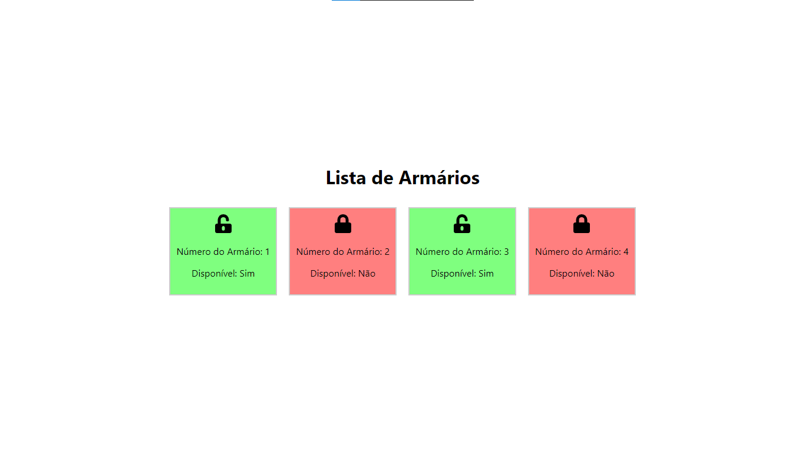

<h1 align="center">Lista de Armários</h1>

<p align="center">
  
</p>

## 📒 Descrição

<p>
  Interface de um sistema de armário feito com React e Styled-Components para meu supervisor de estágio Jefferson Gurguri
</p>

## 🔧 Tecnologias utilizadas

- React
- React Icons
- Styled-Components

## 💻 Pré-requisitos

Antes de começar, verifique se você atendeu aos seguintes requisitos:

- Você tem uma máquina `<Windows / Linux / Mac>`
- Node.js instalado. Você pode instalar o Node através [DESSE LINK](https://nodejs.org/en)

## 🚀 Como Executar o Projeto

```bash
# clone o repositório
$ git clone https://github.com/pedrodev30/armario-app-test.git

# Entre na pasta do projeto
$ cd armario-app-test

# Instale as dependências
$ npm install

# Execute a aplicação
$ npm start
```

- O aplicação estará sendo executado em http://localhost:3000.

## 🤝 Criador

<table>
  <tr>
    <td align="center">
      <a href="#">
        <br>
        <sub>
          <b>Pedro Henrique</b>
        </sub>
      </a>
    </td>
  </tr>
</table>

## 🎯 Status do projeto

A interface está em desenvolvimento ainda.

## :memo: Licença

Esse projeto está sob a licença MIT. Veja o arquivo [LICENSE](https://github.com/pedrodev30/armario-app-test/blob/main/LICENSE) para mais detalhes.
